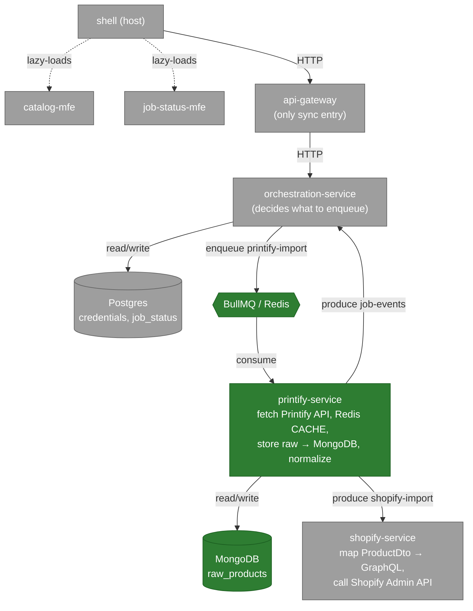
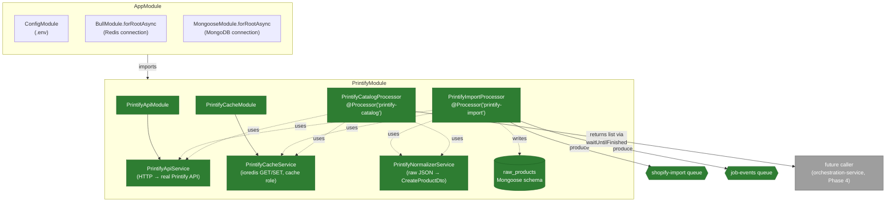

# System Architecture

## Full planned architecture

Green = built (Phase 1-3). Gray = planned, not implemented yet.

## What's built (Phase 1-3)

Only `printify-service` and `packages/product-contract` exist. `printify-service` is both a BullMQ consumer and producer:

- **Consumes**: `printify-import` (fire-and-forget import of one product), `printify-catalog` (sync-over-async catalog page fetch — returns the result as the job's return value instead of a separate reply queue).
- **Produces**: `shopify-import` (hands off a normalized `ProductDto` — no consumer exists yet, this queue just accumulates until shopify-service is built), `job-events` (status updates — same, no consumer yet until orchestration-service is built).

### Redis's two roles

Both live in `services/printify-service` today, in separate modules:

- **Queue role**: `@nestjs/bullmq`'s managed connection — `BullModule.forRootAsync` (connection) + `BullModule.registerQueue(...)` (which queues this service touches) + `@Processor` classes (consumers) + `@InjectQueue().add()` (producers).
- **Cache role**: plain `ioredis` client in `PrintifyCacheService` — simple `GET`/`SET EX` in front of the real Printify API call, TTL from env. No job semantics.

### MongoDB

Owned by `printify-service`: single `raw_products` collection with a `platform` discriminator field (not one collection per source platform) — stores the raw Printify JSON response before normalization, for debugging/replay.

### `printify-service` module map

What actually imports/depends on what inside the one service that's built. Solid arrow = `imports` (DI wiring); dashed arrow = calls a method on an injected class at runtime.

Reading it: `AppModule` only imports `PrintifyModule` to get its processors registered in Nest's DI tree — nothing calls `PrintifyModule`'s providers directly. Both processors depend on the same 3 services (`ApiService`, `CacheService`, `Normalizer`) but never touch each other; they're two independent entry points triggered only by jobs landing on their respective queues.

### Normalization

`PrintifyNormalizerService` converts raw Printify JSON into `CreateProductDto` (from `@hopper/product-contract`), validating the result before it's used. Known traps handled here: Printify prices are integer cents (÷100 → major-unit decimal), Printify's own `images[].position` is a shot-angle string unrelated to the contract's index-based `position` number, and Printify's `visible: boolean` maps onto the contract's `status` enum.

## Not yet built (Phase 4-15)

- **Postgres** (`credentials` envelope-encrypted, `job_status`) — owned by orchestration-service, not implemented.
- **orchestration-service** — decision logic, credential decryption, `job-events` consumer.
- **shopify-service** — GraphQL Admin API client, `shopify-import` consumer.
- **api-gateway** — the only planned synchronous HTTP entry point.
- **Frontend MFEs** — `shell`, `catalog-mfe`, `job-status-mfe`.
- **docker-compose**, **CI**.

Full detail and the queue table (producer/consumer per queue) is in `plans/260728-2056-pod-to-shopify-import-system/plan.md`.
